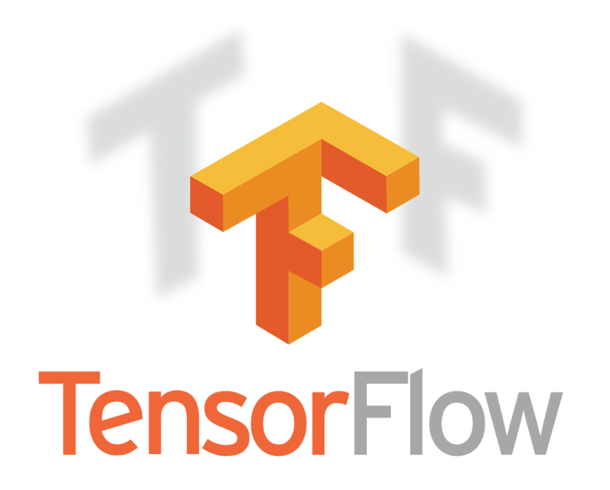
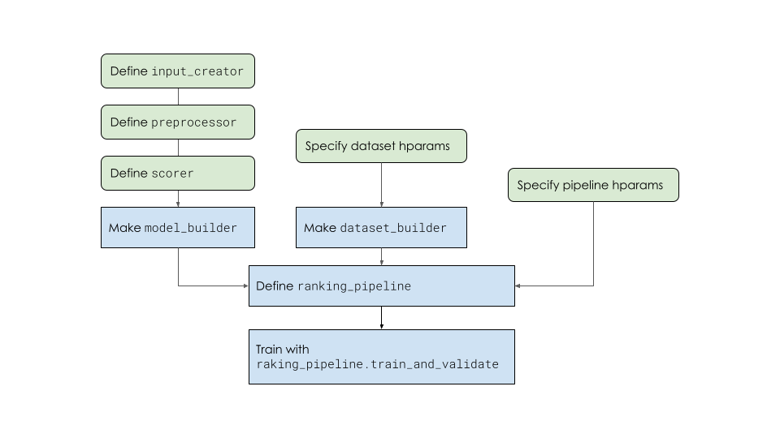

# Microsoft Web10k Learning To Rank Using TensorFlow Ranking

This project was a recent take home from Company A. It's data is sourced from [Microsofts Web10k public dataset](https://www.microsoft.com/en-us/research/project/mslr/) which is the smaller dataset consisting of 10,000 queries. The data is split into five folds for cross validation but, for the sake of this being a take home and computational requirements, I chose to only model with the first fold though the data cleaning and conversion to TFRecords are completed across all folds allowing for future advancements. 

The notebook begins with exploratory data analysis and verifying data integrity across all folds([py file here](helpers.py)). From there, I converted all of the txt records, using [sklearn.datasets.load_svmlight_file](https://scikit-learn.org/stable/modules/generated/sklearn.datasets.load_svmlight_file.html) to TFRecords consisting of the Example List With Context proto from the Tensorflow Serving library ([py file here](tfrecord_converter_.py)). Finally, I built a training pipeline using the TensorFlow Ranking library to show my ability to develop ranking systems ([py file here](build_model.py)). 

Moving forward, this model could use additional training time, potentially alternative feature transformations, and further investigation into the models overall architecture. 

If you'd like to access the cleaned data and tfrecords you can download them from [this link](https://drive.google.com/drive/folders/1FSbQfKVG3JKJhSsFlJ-NS_8hcOF6-BT-?usp=sharing). Due to storage limitations, only Fold1 and the TFRecords associated to Fold1 are available for download. 

It was great to get my hands dirty and learn about ranking systems. If you have any feedback I'd love to hear from you! Contact info below! 

    Kyle Dufrane
    
        Email: kyle.dufrane@gmail.com
        Github: kyledufrane

